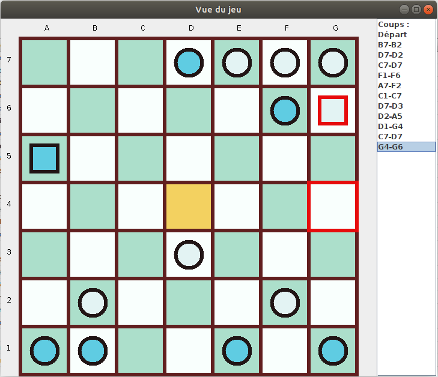

# Devoir 2021

Structure de départ pour le devoir sur le jeu "Labyrinthe de la Vallée des Rois".

Si vous le souhaitez, vous pouvez changer l'organisation ou supprimer les fichiers présents initialement dans ce dépôt.
Les seuls fichiers que vous devez impérativement conserver sont les suivants :

- le fichier .gitignore dans la racine du projet
- l'interface IChallenger.java
- la classe MyChallenger.java
- la classe Client.java (utile pour la partie 3)
- la classe Message.java (utile pour la partie 3)


___

## Pour tester les joueurs IA :

**1. Lancer l'arbitre**

Pour conduire une partie dans les conditions du tournoi, vous devez lancer 3 processus java en parallèle, depuis 3 consoles différentes.
Tout d'abord vous devez lancer l'arbitre qui ouvrira un serveur pour échanger avec les deux joueurs :

```java -cp KVL_1.1.jar games.kingsvalley.KVDuel -p 4536 -g```

**NB :**
- le code de KVL_1.1.jar marche avec la version 11 de java,
- l'option -g, facultative, correspond à l'utilisation de l'interface graphique (voir plus bas).

**2. Lancer un joueur déjà implémenté**

Dans les 15 s qui suivent le démarrage de l'arbitre, vous devez lancer indépendamment deux joueurs. L'archive KVL_1.1.jar contient, en plus de l'arbitre, le code pour différents types de joueurs avec lesquels vous pourrez expérimenter.

Commande pour lancer un joueur aléatoire déjà implémenté :

```java -cp KVL_1.1.jar iialib.games.contest.Client -p 4536 -s localhost -c games.kingsvalley.KVRandomChallenger```

Commande pour lancer un joueur AlphaBeta déjà implémenté :

```java -cp KVL_1.1.jar iialib.games.contest.Client -p 4536 -s localhost -c games.kingsvalley.KVAlphaBetaChallenger```

Commande pour lancer un joueur humain déjà implémenté (les coups sont à entrer dans la console) :

```java -cp KVL_1.1.jar iialib.games.contest.Client -p 4536 -s localhost -c games.kingsvalley.KVHumanChallenger```

**3. Lancer votre propre joueur**

Pour pouvoir tester votre propre joueur, il vous faut compiler le code de votre projet dans une archive JAR, par exemple PRXX_KVL_player.jar. La commande pour le lancer sera alors de la forme :

```java -cp PRXX_KVL_player.jar:commons-cli-1.4.jar path.to.Client -p 4536 -s localhost -c path.to.MyChallenger```

Par exemple, si vous avez gardé la structure initiale du code :

```java -cp PRXX_KVL_player.jar:commons-cli-1.4.jar iialib.games.contest.Client -p 4536 -s localhost -c games.kingsvalley.MyChallenger```

Si vous souhaitez réaliser un essai rapidement avec votre projet, vous pouvez éventuellement inclure la classe KVHumanChallenger.java (disponible en bas de la page) dans votre code :

```java -cp PRXX_KVL_player.jar:commons-cli-1.4.jar path.to.Client -p 4536 -s localhost -c path.to.KVHumanChallenger```

**NB :**
- l'archive commons-cli-1.4.jar correspond à un code tiers pour lire les paramètres dans la commande, il vous suffit de la placer dans le même dossier que votre archive PRXX_KVL_player.jar.

**4. Interface graphique**

Voici un aperçu de ce que vous devriez voir en utilisant l'option -g :



Vous pouvez naviguer dans la liste des coups joués en utilisant les flèches ou en cliquant sur une ligne du panneau latéral.
